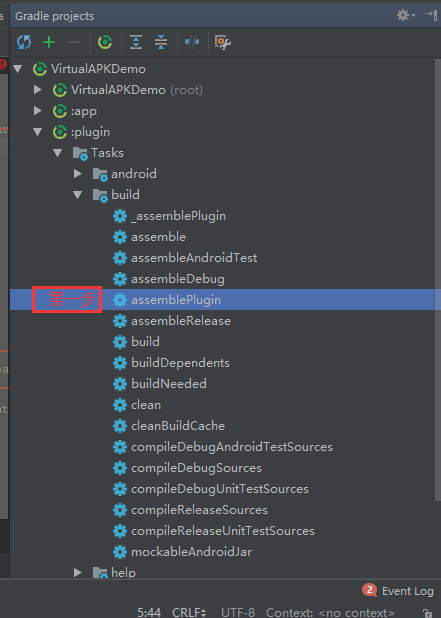
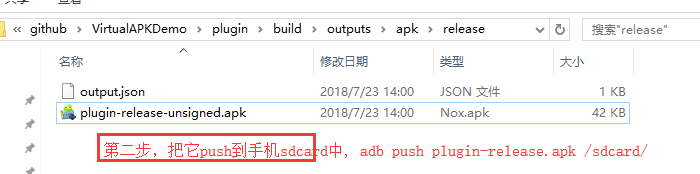

# 滴滴插件化
> 如果碰到其他问题，可查看官方的 [Wiki](https://github.com/didi/VirtualAPK/wiki)

plugin 的 apk 必须是 assemblePlugin 生成的!

具体步骤：

adb push 将 plugin.apk 推送到手机sdcard（测试用，实际项目可以是从网络下载到指定目录）

app 中加载 plugin.apk，然后可以跳转 plugin.apk 页面